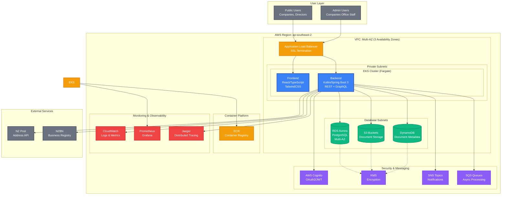

# NZ Companies Register - System Architecture

## Overview

The NZ Companies Register System is a modern, cloud-native application built to comply with the Companies Act 1993. It provides a secure, scalable, and highly available platform for managing company registrations, compliance workflows, and public record access.

## Architecture Diagram

## Key Components

### 1. User Layer
- **Public Users**: Companies, directors, and general public accessing the register
- **Admin Users**: Companies Office staff managing registrations and compliance

### 2. Application Layer
- **Frontend**: React/TypeScript with TailwindCSS and ShadCN/UI components
- **Backend**: Kotlin/Spring Boot 3 with REST and GraphQL APIs
- **Container Platform**: AWS EKS with Fargate for serverless containers

### 3. Data Layer
- **RDS Aurora PostgreSQL**: Multi-AZ cluster for transactional data
- **DynamoDB**: Document metadata and historical snapshots
- **S3 Buckets**: Document storage with lifecycle policies

### 4. Security & Messaging
- **AWS Cognito**: OAuth2/JWT authentication and authorization
- **KMS**: Encryption keys for data at rest and in transit
- **SNS/SQS**: Notifications and asynchronous processing

### 5. Monitoring & Observability
- **CloudWatch**: Application logs and AWS service metrics
- **Prometheus + Grafana**: Custom metrics and dashboards
- **Jaeger**: Distributed tracing for performance monitoring

### 6. External Services
- **NZ Post API**: Address validation and postal services
- **NZBN**: Business registry integration (future)

## Architecture Principles

### 1. Security First
- **Encryption**: End-to-end encryption using AWS KMS
- **Authentication**: OAuth2/JWT with AWS Cognito
- **Authorization**: Role-based access control (RBAC)
- **Audit Logging**: Complete audit trail for compliance

### 2. High Availability
- **Multi-AZ**: Database and application deployment across 3 AZs
- **Auto-scaling**: ECS Fargate with horizontal pod autoscaling
- **Load Balancing**: Application Load Balancer with health checks
- **Disaster Recovery**: Cross-region backup and restore capabilities

### 3. Scalability
- **Horizontal Scaling**: Auto-scaling from 2-10 backend instances
- **Database Scaling**: Read replicas for query optimization
- **Caching**: Application-level caching for performance
- **CDN**: CloudFront for static asset delivery

### 4. Compliance
- **Companies Act 1993**: Full compliance with NZ legislation
- **Data Retention**: 7+ year retention with automated lifecycle
- **Immutable Records**: Historical snapshots per section 89
- **Privacy**: GDPR and Privacy Act compliance

### 5. Observability
- **Structured Logging**: JSON logs with correlation IDs
- **Metrics**: Business and technical metrics collection
- **Alerting**: Proactive monitoring with PagerDuty integration
- **Tracing**: End-to-end request tracing

## Performance Targets

| Metric | Target | Monitoring |
|--------|--------|------------|
| Search Response Time | < 500ms | CloudWatch Alarms |
| Public Record Access | < 300ms median | Custom Metrics |
| System Uptime | 99.9% SLA | Multi-layer monitoring |
| Database Response | < 100ms | RDS Performance Insights |
| API Throughput | 1000 RPS | ALB metrics |

## Security Measures

### 1. Network Security
- **VPC**: Private subnets with NAT gateways
- **Security Groups**: Least privilege access rules
- **WAF**: Web Application Firewall protection
- **DDoS Protection**: AWS Shield Standard/Advanced

### 2. Data Security
- **Encryption at Rest**: KMS encryption for all data stores
- **Encryption in Transit**: TLS 1.3 for all communications
- **Key Rotation**: Automatic KMS key rotation
- **Secrets Management**: AWS Secrets Manager

### 3. Application Security
- **RBAC**: Role-based access control
- **JWT Validation**: Token-based authentication
- **Input Validation**: Comprehensive input sanitization
- **Rate Limiting**: API throttling and abuse prevention

### 4. Compliance Security
- **Audit Logging**: Complete activity audit trail
- **Data Retention**: Automated lifecycle policies
- **Backup Security**: Encrypted backups with versioning
- **Incident Response**: Security incident procedures

## Deployment Strategy

### 1. Infrastructure as Code
- **AWS CDK**: Python-based infrastructure definitions
- **Version Control**: Git-based infrastructure versioning
- **Testing**: Comprehensive CDK unit and integration tests
- **Validation**: Template validation and security scanning

### 2. CI/CD Pipeline
- **GitHub Actions**: Automated build and deployment
- **Container Registry**: ECR with vulnerability scanning
- **Blue-Green Deployment**: Zero-downtime deployments
- **Rollback Strategy**: Automated rollback on failures

### 3. Environment Management
- **Development**: Local Docker Compose stack
- **Testing**: Dedicated testing environment
- **Staging**: Production-like environment
- **Production**: Multi-AZ production deployment

## Cost Optimization

### 1. Right-sizing
- **ECS Fargate**: Pay-per-use serverless containers
- **Aurora Serverless**: Auto-scaling database capacity
- **S3 Intelligent Tiering**: Automated storage cost optimization
- **Reserved Instances**: Cost savings for predictable workloads

### 2. Monitoring
- **Cost Alerts**: Automated cost threshold alerts
- **Usage Analytics**: Regular cost and usage analysis
- **Resource Optimization**: Continuous rightsizing recommendations
- **Waste Elimination**: Automated resource cleanup

## Future Enhancements

### 1. Short Term (6 months)
- **Mobile Application**: React Native mobile app
- **API Gateway**: Centralized API management
- **Enhanced Search**: Elasticsearch integration
- **Document OCR**: Automated document processing

### 2. Long Term (12+ months)
- **Bilingual Support**: English/Māori interfaces
- **NZBN Integration**: Business registry synchronization
- **Advanced Analytics**: AI-powered insights
- **Blockchain Registry**: Immutable record keeping

---

*This architecture supports the full requirements of the Companies Act 1993 while providing a modern, scalable, and secure platform for New Zealand's company registry system.*